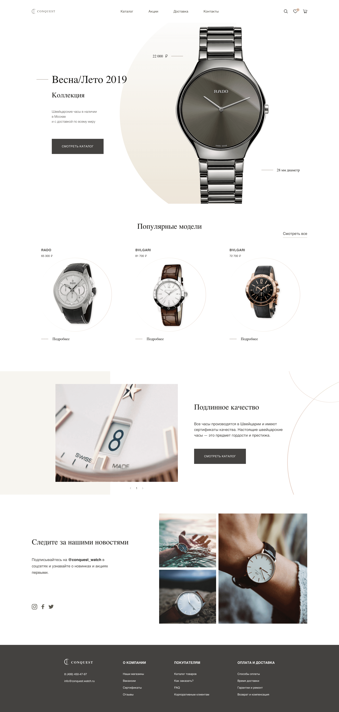

# Проект "CONQUEST"

## Для запуска проекта - "make run".

### Демонстрация экрана:

### Функционал:
* Адаптивно-отзывчивая верстка
* Текст защищен от переполнения
* Рендринг списков через JS
* Поддержка Retina, вплоть до HiDPI 4dppx
* Оптимизированы все изображения и иконки
* Все шрифты вшиты в проет
* Добавлены стили состояний
* Добавлена простенькая возможность листать слайдер

### Поддерживаемые браузеры:
* edge от "17"
* ie от "11"
* firefox от "50"
* chrome от "64"
* safari от "11.1"

### Технологии:

* ООП
* Методология БЭМ
* Файловая структура БЭМ Nested
* HTML
* SASS
* JavaScript
* Webpack
* Flexbox
* Grid Layout
* CSS transitions
* Git

### Язык:

* Русский

### Для улучшения:

* Реализовать навигацию слайдера и рендринг его элементов в одном компоненте
